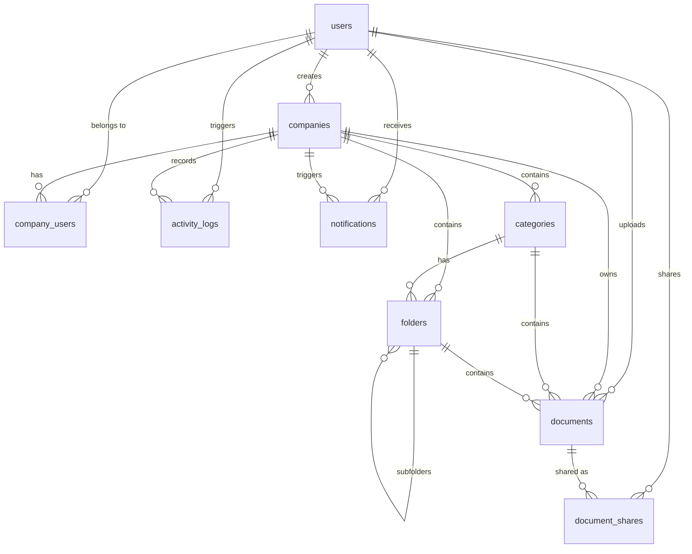

# Database Design Specification
## Work Index — Corporate Document Management System

| Version | Date | Status | Authors |
|---|---|---|---|
| v1.0 | 2026-06-12 | Released | Antigravity AI |

---

## 1. Overview
Work Index stores metadata and relationship mappings inside a **PostgreSQL 15** database, while files are saved as block objects on local disk (with path storage in DB) or S3-compatible cloud storage. The database schema enforces multi-company tenant isolation and system audit logging.

---

## 2. Entity Relationship Diagram (ERD)
The following Mermaid diagram shows the table schemas and relationships.

---

## 3. Data Dictionary (Table Schemas)

### 3.1. users
Stores details of registered users.

| Column | Type | Constraints | Description |
|---|---|---|---|
| `id` | UUID | PRIMARY KEY, Default: `gen_random_uuid()` | Unique user identifier. |
| `email` | VARCHAR(255) | UNIQUE, NOT NULL | User's email login address. |
| `password_hash`| VARCHAR(255) | NOT NULL | Bcrypt-hashed password. |
| `full_name` | VARCHAR(255) | NOT NULL | User's full name. |
| `role` | VARCHAR(50) | CHECK: `super_admin`, `admin`, `editor`, `viewer`, Default: `admin` | Global user role. |
| `is_active` | BOOLEAN | Default: `true` | Active state of the user account. |
| `last_login` | TIMESTAMP | Nullable | Records last login timestamp. |
| `created_at` | TIMESTAMP | Default: `NOW()` | Timestamp of account registration. |
| `updated_at` | TIMESTAMP | Default: `NOW()` | Timestamp of last account details update. |

### 3.2. companies
Stores company profiles.

| Column | Type | Constraints | Description |
|---|---|---|---|
| `id` | UUID | PRIMARY KEY, Default: `gen_random_uuid()` | Unique company identifier. |
| `name` | VARCHAR(255) | NOT NULL | Legal company name. |
| `company_type` | VARCHAR(50) | NOT NULL, CHECK: `pvt_ltd`, `ltd`, `llp`, `partnership`, `proprietorship` | Legal entity classification. |
| `cin` | VARCHAR(21) | Nullable | Corporate Identification Number (India). |
| `pan` | VARCHAR(10) | Nullable | Permanent Account Number. |
| `gstin` | VARCHAR(15) | Nullable | GST Identification Number. |
| `registered_address` | TEXT | Nullable | Official registered address. |
| `state` | VARCHAR(100) | Nullable | State in registered address. |
| `city` | VARCHAR(100) | Nullable | City in registered address. |
| `pincode` | VARCHAR(6) | Nullable | Postal code. |
| `incorporation_date` | DATE | Nullable | Date of incorporation. |
| `logo_url` | TEXT | Nullable | URL to company logo asset. |
| `is_active` | BOOLEAN | Default: `true` | Active status of company instance. |
| `created_by` | UUID | REFERENCES `users(id)` | User who registered the company. |
| `created_at` | TIMESTAMP | Default: `NOW()` | Company creation date. |
| `updated_at` | TIMESTAMP | Default: `NOW()` | Company profile last updated. |

### 3.3. company_users
Maps users to companies they have access to. Enables multi-company access.

| Column | Type | Constraints | Description |
|---|---|---|---|
| `id` | UUID | PRIMARY KEY, Default: `gen_random_uuid()` | Unique record identifier. |
| `company_id` | UUID | REFERENCES `companies(id)` ON DELETE CASCADE | Company reference. |
| `user_id` | UUID | REFERENCES `users(id)` ON DELETE CASCADE | User reference. |
| `role` | VARCHAR(50) | CHECK: `admin`, `editor`, `viewer`, Default: `viewer` | User's role specific to this company. |
| `created_at` | TIMESTAMP | Default: `NOW()` | Date added to company user list. |
| *Composite Constraint* | UNIQUE(`company_id`, `user_id`) | Unique Index | Restricts double associations. |

### 3.4. categories
Pre-seeded categories that organize the documents.

| Column | Type | Constraints | Description |
|---|---|---|---|
| `id` | UUID | PRIMARY KEY, Default: `gen_random_uuid()` | Unique identifier. |
| `company_id` | UUID | REFERENCES `companies(id)` ON DELETE CASCADE | Company reference. |
| `name` | VARCHAR(255) | NOT NULL | Category name. |
| `slug` | VARCHAR(255) | NOT NULL | URL-safe name slug. |
| `description` | TEXT | Nullable | Category description. |
| `icon` | VARCHAR(100) | Nullable | UI icon component key. |
| `color` | VARCHAR(7) | Default: `#4F46E5` | Color code for category cards. |
| `sort_order` | INTEGER | Default: `0` | UI sort placement index. |
| `is_active` | BOOLEAN | Default: `true` | Category active status. |
| `created_at` | TIMESTAMP | Default: `NOW()` | Category seed timestamp. |
| `updated_at` | TIMESTAMP | Default: `NOW()` | Category update timestamp. |
| *Composite Constraint* | UNIQUE(`company_id`, `slug`) | Unique Index | Restricts duplicate slugs per company. |

### 3.5. folders
Folders inside categories to create hierarchical structure.

| Column | Type | Constraints | Description |
|---|---|---|---|
| `id` | UUID | PRIMARY KEY, Default: `gen_random_uuid()` | Unique folder identifier. |
| `company_id` | UUID | REFERENCES `companies(id)` ON DELETE CASCADE | Company reference. |
| `category_id` | UUID | REFERENCES `categories(id)` ON DELETE CASCADE | Category reference. |
| `parent_folder_id`| UUID | REFERENCES `folders(id)` ON DELETE CASCADE, Nullable | Subfolder self-reference. |
| `name` | VARCHAR(255) | NOT NULL | Folder name. |
| `slug` | VARCHAR(255) | NOT NULL | URL-safe slug. |
| `description` | TEXT | Nullable | Folder description text. |
| `sort_order` | INTEGER | Default: `0` | Sorting order index. |
| `is_active` | BOOLEAN | Default: `true` | Active folder status. |
| `created_by` | UUID | REFERENCES `users(id)` | User who created this custom folder. |
| `created_at` | TIMESTAMP | Default: `NOW()` | Folder creation timestamp. |
| `updated_at` | TIMESTAMP | Default: `NOW()` | Folder update timestamp. |

### 3.6. documents
Stores document metadata and references to the stored file.

| Column | Type | Constraints | Description |
|---|---|---|---|
| `id` | UUID | PRIMARY KEY, Default: `gen_random_uuid()` | Unique document identifier. |
| `company_id` | UUID | REFERENCES `companies(id)` ON DELETE CASCADE | Company reference. |
| `category_id` | UUID | REFERENCES `categories(id)` ON DELETE SET NULL, Nullable | Category reference. |
| `folder_id` | UUID | REFERENCES `folders(id)` ON DELETE SET NULL, Nullable | Folder reference. |
| `title` | VARCHAR(500) | NOT NULL | User-visible document title. |
| `description` | TEXT | Nullable | Document description details. |
| `file_name` | VARCHAR(500) | NOT NULL | Original uploaded file name. |
| `file_path` | TEXT | NOT NULL | Location of the file on disk/S3. |
| `file_size` | BIGINT | Nullable | File size in bytes. |
| `file_type` | VARCHAR(50) | Nullable | File extension. |
| `mime_type` | VARCHAR(100) | Nullable | HTTP MIME type. |
| `document_date`| DATE | Nullable | Date printed on the document. |
| `financial_year`| VARCHAR(10) | Nullable | Target FY (e.g. `FY 2025-26`). |
| `tags` | TEXT[] | Array, Nullable | Tags array. |
| `status` | VARCHAR(50) | CHECK: `active`, `archived`, `deleted`, Default: `active` | Active/soft-deleted state. |
| `is_verified` | BOOLEAN | Default: `false` | Verification status. |
| `verified_by` | UUID | REFERENCES `users(id)`, Nullable | User who verified. |
| `verified_at` | TIMESTAMP | Nullable | Timestamp of verification. |
| `uploaded_by` | UUID | REFERENCES `users(id)`, Nullable | User who uploaded. |
| `version` | INTEGER | Default: `1` | Document version number. |
| `parent_document_id`| UUID | REFERENCES `documents(id)`, Nullable | Reference for version tracking. |
| `remarks` | TEXT | Nullable | Admin/verifier remarks. |
| `created_at` | TIMESTAMP | Default: `NOW()` | Document upload timestamp. |
| `updated_at` | TIMESTAMP | Default: `NOW()` | Metadata update timestamp. |

### 3.7. activity_logs
Tracks actions performed by users.

| Column | Type | Constraints | Description |
|---|---|---|---|
| `id` | UUID | PRIMARY KEY, Default: `gen_random_uuid()` | Unique identifier. |
| `company_id` | UUID | REFERENCES `companies(id)` ON DELETE CASCADE | Target company profile. |
| `user_id` | UUID | REFERENCES `users(id)`, Nullable | Actor user identifier. |
| `action` | VARCHAR(100) | NOT NULL | Action key (e.g., `DOCUMENT_UPLOAD`). |
| `entity_type` | VARCHAR(50) | Nullable | Type of object affected. |
| `entity_id` | UUID | Nullable | ID of object affected. |
| `entity_name` | VARCHAR(500) | Nullable | Name of object affected. |
| `details` | JSONB | Nullable | Meta payload of changes/params. |
| `ip_address` | INET | Nullable | Request source IP. |
| `created_at` | TIMESTAMP | Default: `NOW()` | Event timestamp. |

### 3.8. document_shares
Tracks share links generated for documents.

| Column | Type | Constraints | Description |
|---|---|---|---|
| `id` | UUID | PRIMARY KEY, Default: `gen_random_uuid()` | Unique share identifier. |
| `document_id` | UUID | REFERENCES `documents(id)` ON DELETE CASCADE | Shared document reference. |
| `shared_by` | UUID | REFERENCES `users(id)` | User who created the share link. |
| `shared_with_email`| VARCHAR(255) | Nullable | Target recipient email. |
| `share_token` | VARCHAR(255) | UNIQUE, Nullable | Secure token string. |
| `access_type` | VARCHAR(20) | CHECK: `view`, `download`, Default: `view` | Shared permission level. |
| `expires_at` | TIMESTAMP | Nullable | Token expiration timestamp. |
| `is_active` | BOOLEAN | Default: `true` | Active share switch. |
| `accessed_at` | TIMESTAMP | Nullable | Timestamp of last access. |
| `created_at` | TIMESTAMP | Default: `NOW()` | Timestamp of share link creation. |

### 3.9. notifications
Stores notifications for users.

| Column | Type | Constraints | Description |
|---|---|---|---|
| `id` | UUID | PRIMARY KEY, Default: `gen_random_uuid()` | Unique notification identifier. |
| `user_id` | UUID | REFERENCES `users(id)` ON DELETE CASCADE | Recipient user reference. |
| `company_id` | UUID | REFERENCES `companies(id)`, Nullable | Company context of notification. |
| `title` | VARCHAR(255) | NOT NULL | Header text. |
| `message` | TEXT | Nullable | Body description text. |
| `type` | VARCHAR(50) | CHECK: `info`, `warning`, `success`, `error`, Default: `info` | Alert type. |
| `entity_type` | VARCHAR(50) | Nullable | Associated object type. |
| `entity_id` | UUID | Nullable | Associated object ID. |
| `is_read` | BOOLEAN | Default: `false` | Read status. |
| `created_at` | TIMESTAMP | Default: `NOW()` | Creation timestamp. |

---

## 4. Indexing Strategy
To optimize query performance under high document load, the database includes indices on foreign keys and search fields:
- `idx_documents_company`: B-Tree index on `documents(company_id)`. Essential for multi-company isolation filters.
- `idx_documents_category`: B-Tree index on `documents(category_id)`.
- `idx_documents_folder`: B-Tree index on `documents(folder_id)`.
- `idx_documents_status`: B-Tree index on `documents(status)`. Speeds up search by filtering out soft-deleted records.
- `idx_documents_tags`: GIN index on the array column `documents(tags)`. Enables fast lookup of custom tag array overlaps.
- `idx_folders_category`: B-Tree index on `folders(category_id)`.
- `idx_activity_company`: B-Tree index on `activity_logs(company_id)`. Speeds up the rendering of company audit trails.
- `idx_activity_user`: B-Tree index on `activity_logs(user_id)`.
- `idx_notifications_user`: B-Tree index on `notifications(user_id)`. Speeds up loading notifications for the logged-in user.
