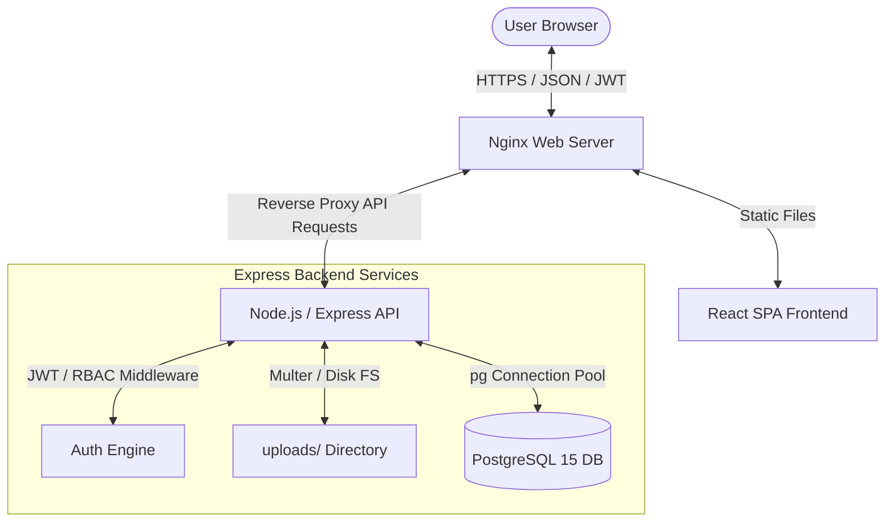

# Technical Architecture Document
## Work Index — Corporate Document Management System

| Version | Date | Status | Authors |
|---|---|---|---|
| v1.0 | 2026-06-12 | Released | ANGC Synapse |

---

## 1. System Topology
Work Index uses a 3-tier architectural design. The frontend is a React-based single-page application served via an Nginx web server. The application logic is handled by a Node.js/Express REST API service. The data layers consist of a PostgreSQL database for structured metadata and a local disk storage partition for file assets.



---

## 2. Directory Structure Mapping
The workspace is organized to keep frontend and backend contexts separated:

```
work-index/
├── backend/
│   ├── src/
│   │   ├── config/       # pg connection pool, migration scripts, pre-seeds
│   │   ├── controllers/  # Route handler controllers (auth, documents, teams, etc.)
│   │   ├── middleware/   # JWT auth, company access verify, RBAC checks, Multer
│   │   ├── routes/       # Central Express API router definition
│   │   └── server.js     # Express server startup and server configuration
│   ├── uploads/          # Physical file uploads (gitignored directory)
│   ├── Dockerfile
│   └── package.json
├── frontend/
│   ├── src/
│   │   ├── components/   # Modular UI components (modals, search bars, layout templates)
│   │   ├── context/      # React contexts (Auth State wrapper)
│   │   ├── pages/        # Main route views (Dashboard, Settings, Reports, etc.)
│   │   ├── utils/        # Axios wrapper and string helpers
│   │   ├── App.jsx       # Route mapper configuration
│   │   └── index.js
│   ├── Dockerfile
│   ├── nginx.conf
│   └── package.json
└── docker-compose.yml    # Main orchestration docker file
```

---

## 3. Request Middleware Pipeline
Every request sent to an authenticated endpoint traverses a strict verification pipeline:

```
Request Received
       │
       ▼
[authenticate] ──────────────► Invalid Token / Expired ? ──► Return 401 Unauthorized
       │ (Valid JWT)
       ▼
[verifyCompanyAccess] ───────► Not associated with Company ? ──► Return 403 Forbidden
       │ (Extracts Company User Role)
       ▼
[requireCompanyRole] ────────► Role not in allowed array ? ──► Return 403 Forbidden
       │ (Role matches required capabilities)
       ▼
[Controller Handler]
       │
       ▼
Execute Database Query / Return Response
```

### 3.1. Middleware Details
1.  **authenticate (`auth.js`)**: Extracts the Bearer token from the `Authorization` header, verifies the signature using `jsonwebtoken` against the environment variable `JWT_SECRET`, checks if the user exists and is flagged as active in the database, and injects the user model into `req.user`.
2.  **verifyCompanyAccess (`auth.js`)**: Extracts `companyId` from route parameters, request body, or query strings. It queries `company_users` to verify the user belongs to the company, and sets `req.companyRole` with the role (`admin`, `editor`, `viewer`).
3.  **requireCompanyRole (`auth.js`)**: Takes a list of allowed roles (e.g. `admin`, `editor`). If the active company role (`req.companyRole`) is not in the allowed list, it returns a 403 error. Platform `super_admin` accounts bypass this check.

---

## 4. Storage Architecture
The storage engine handles file writes and reads:

```
        Multipart Form Upload
                  │
                  ▼
          [Multer Middleware]
                  │
          (File size & Type check)
                  │
                  ▼
     Generate UUID File Name
                  │
                  ▼
  Write to disk: backend/uploads/
                  │
                  ▼
   Save file path in database
```

### 4.2. S3 Migration path
The architecture is designed to swap local storage for cloud object storage. By modifying the `middleware/upload.js` configuration to use the `multer-s3` storage driver, uploads stream directly to an Amazon S3 bucket, storing the S3 object URL in the database's `file_path` column.

---

## 5. Security Control Implementation
- **Data sanitization**: The Express layer uses parameterized queries (e.g. `pool.query('SELECT * FROM users WHERE id = $1', [userId])`). This prevents SQL injection.
- **HTTP Hardening**: The API container includes `helmet` middleware, configuring headers like X-Content-Type-Options, X-Frame-Options, and Content-Security-Policy.
- **Formula Injection Mitigation**: The CSV report exports filter and sanitize cells starting with formula symbols (`=`, `+`, `-`, `@`) by prepending a single quote (`'`), preventing Remote Code Execution when opened in Microsoft Excel.
