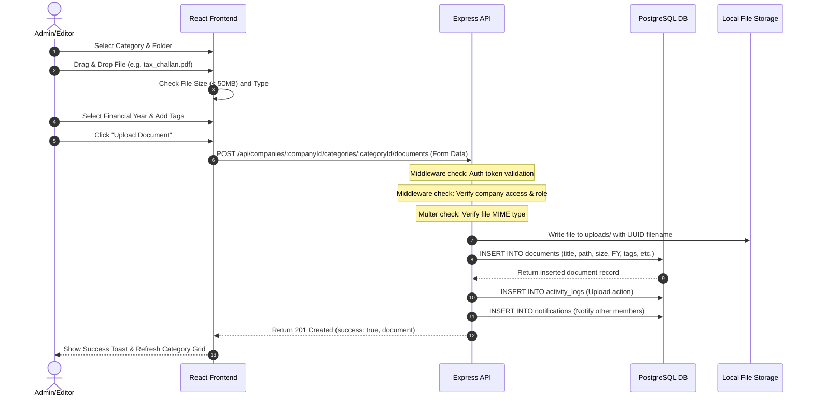
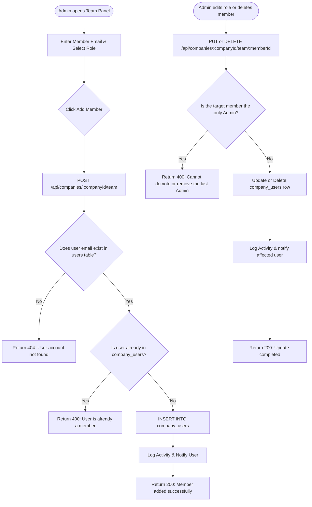
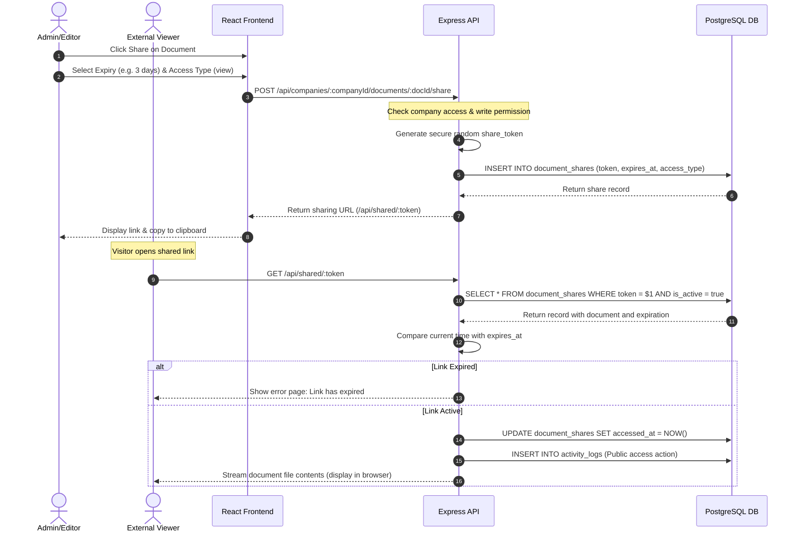
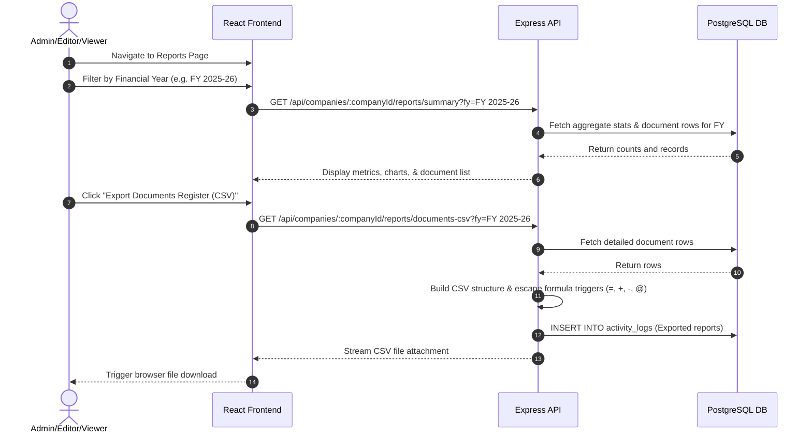

# User Flow Specification
## Work Index — Corporate Document Management System

| Version | Date | Status | Authors |
|---|---|---|---|
| v1.0 | 2026-06-12 | Released | Antigravity AI |

---

## 1. Document Upload Flow
This flow represents how an Admin or Editor uploads a document into a specific company's category and folder structure, complete with validations.

---

## 2. Team Member Management & Safeguards Flow
This flow details how an Admin invites a new user or demotes an existing member, showcasing the last-admin protection safeguard.

---

## 3. Secure Share Link Generation & Access Flow
This flow details how a document is shared externally and verified on access.

---

## 4. Compliance Document Register Export Flow
This flow details how reports are compiled and exported as a CSV register.

